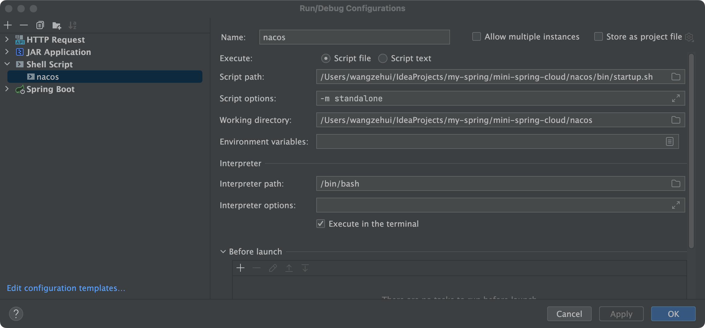
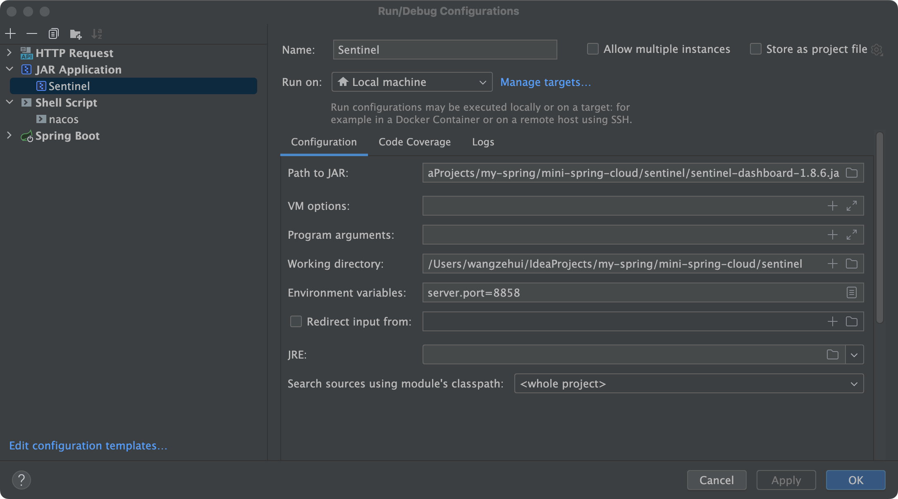
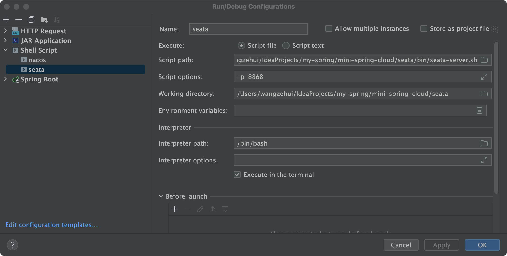

## tiny
> tiny意思微小的，本项目使用spring-boot、spring-cloud、spring-cloud-alibaba进行搭建


## [版本说明](https://github.com/alibaba/spring-cloud-alibaba/wiki/%E7%89%88%E6%9C%AC%E8%AF%B4%E6%98%8E)
> jdk17目录结构大改，影响项目非常大，运维成本高，仍用jdk1.8  
> 当前支持jdk1.8 spring-boot版本2.7.14，项目集成spring-cloud+alibaba，需要考虑版本兼容问题，见官网

## 组织结构
```
tiny
├─tiny-common               -- 公共组件包
│  ├─tiny-common-cloud      -- spring-cloud核心依赖（nacos、openfegin、loadbalancer、cloud环境上下文、限流sentinel（待完成）、分布式事务seata（待完成） ）
│  ├─tiny-common-core       -- spring-boot核心依赖、常量类、通用返回类，工具类（各种工具类，hutool、guava）
│  ├─tiny-common-genertor   -- 代码生成器（mybatisplus模板、mybatis模板）
│  ├─tiny-common-starter    -- 开胃菜，自定义starter
│  │  ├─tiny-common-starter-redis          -- redis-单数据源
│  │  ├─tiny-common-starter-mongo          -- mongo-单数据源，如果配置多个，在写一套就行了
│  │  ├─tiny-common-starter-xxl            -- xxl
│  │  └─tiny-common-starter-mq             -- mq(待完成)
│  └─tiny-common-web        -- 包含tool包，拦截器、过滤器、Body请求加密和响应处理、全局log（待完成）、全局接口耗时(待完成)
├─tiny-dependencies         -- 统一管理依赖，版本锁死
├─tiny-gateway              -- 网关服务，路由规则、跨域、空白页改造，header解析token，token失效判断-redis（待完成），用户状态判断-fegin调用（待完成）
│  ├─xxx                    -- xxx
│  └─xxx                    -- xxx
├─tiny-demo                 -- 样例服务，添加新模块可当做参照，测试类有生成代码模板
│  ├─xxx                    -- xxx
│  └─xxx                    -- xxx
└─bbb  -- bbb
```

## 端口说明
|   服务名   |  端口   | 机器 |
|:-------:|:-----:|:--:|
| gateway | 8080  | xx |
| example | 10000 | xx |

## 环境准备
> （1）本地添加nacos，参照  [访问地址](http://localhost:8848/nacos/)        
> （2）本地添加sentinel，参照  [访问地址](http://localhost:8858/#/login)       
> （3）本地添加seata，参照  [访问地址](http://localhost:8858/#/login)       

## 说明
> （1）新添加model可以参考example工程  
> （2）主pom进行打包，进入样例服务jar包目录，执行`java -jar -Dspring.profiles.active=local tiny-example-1.0-SNAPSHOT.jar`可以正常启动